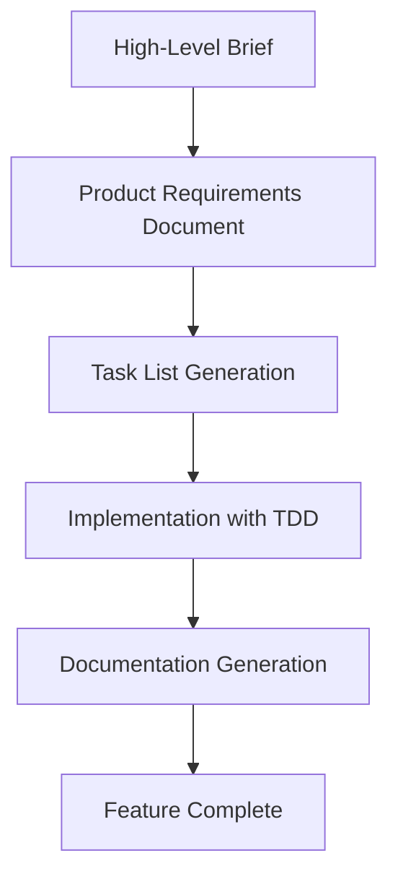

# Workflow Guide

This guide walks you through the complete development workflow using the Claude Code Command Template.

## Overview

The workflow consists of 5 main stages that take you from initial idea to implemented feature:



## Stage 1: High-Level Brief

### Purpose
Capture your initial feature idea in a simple, clear format.

### Process
1. Create a new directory under `tasks/` for your feature
2. Write a brief markdown file describing your idea
3. Keep it simple - just the core concept

### Example
```bash
mkdir tasks/user-authentication
```

Create `tasks/user-authentication/user-auth-brief.md`:
```markdown
# User Authentication System

## Overview
Implement a secure user authentication system for the web application.

## Key Requirements
- User registration with email verification
- Secure login/logout functionality
- Password reset capability
- User profile management

## Goals
- Improve security of the application
- Enable personalized user experiences
- Reduce anonymous usage
```

### Tips
- Focus on **what** you want, not **how** to build it
- Include the problem you're solving
- Keep it under 200 words initially
- You'll expand on this during PRD creation

## Stage 2: Product Requirements Document (PRD)

### Purpose
Transform your brief into a detailed, actionable specification.

### Process
1. Run `/create-prd <path-to-brief-file>`
2. Answer the clarifying questions Claude asks
3. Review and refine the generated PRD

### What Claude Will Ask
- **Problem/Goal**: What problem does this solve?
- **Target Users**: Who will use this feature?
- **User Stories**: How will users interact with it?
- **Acceptance Criteria**: How do we know it's done?
- **Scope Boundaries**: What's explicitly out of scope?

### Example Interaction
```
You: /create-prd tasks/user-authentication/user-auth-brief.md

Claude: I'll help you create a PRD. Let me ask some clarifying questions:

1. Who are the primary users of this authentication system?
2. What authentication methods do you want to support?
3. Are there any compliance requirements (GDPR, etc.)?
...

You: [Answer the questions]

Claude: [Generates detailed PRD with functional requirements]
```

### PRD Structure
The generated PRD will include:
- **Introduction/Overview**
- **Goals** (measurable objectives)
- **User Stories**
- **Functional Requirements** (numbered list)
- **Non-Goals** (scope boundaries)
- **Technical Considerations**
- **Success Metrics**

## Stage 3: Task List Generation

### Purpose
Break down the PRD into actionable development tasks following TDD principles.

### Process
1. Run `/generate-tasks <feature-directory>`
2. Review the high-level tasks
3. Confirm with "Go" to generate detailed sub-tasks

### Two-Phase Generation
**Phase 1**: High-level parent tasks
```
Claude: I've generated these parent tasks:
1. Set up authentication infrastructure
2. Implement user registration
3. Implement login/logout
4. Add password reset functionality
5. Create user profile management

Ready to generate sub-tasks? Respond with 'Go' to proceed.
```

**Phase 2**: Detailed sub-tasks with TDD approach
```markdown
## Tasks

- [ ] 1.0 Set up authentication infrastructure
  - [ ] 1.1 Write acceptance test for auth middleware
  - [ ] 1.2 Create auth middleware with mocked user service
  - [ ] 1.3 Implement user service interface
  - [ ] 1.4 Set up JWT token handling
  - [ ] 1.5 Configure session management
```

### Task Structure
- Tasks follow **Outside-In TDD** methodology
- Each parent task has specific sub-tasks
- Sub-tasks are ordered logically
- Includes relevant files section

## Stage 4: Implementation with TDD

### Purpose
Execute the tasks systematically using test-driven development.

### Process
1. Run `/process-task-list <feature-name>`
2. Work through tasks one sub-task at a time
3. Follow the TDD cycle for each task
4. Update task list as you progress

### TDD Methodology: Outside-In

**The 7-Step Process:**

1. **Acceptance Test (Red)** - Write failing end-to-end test
2. **Bootstrap** - Create minimal structure to compile
3. **Inner Loop** - Unit tests with mocked collaborators
4. **Cascade Inward** - Implement dependencies layer by layer
5. **Acceptance Test (Green)** - Verify end-to-end functionality
6. **Refactor** - Clean up while keeping tests green
7. **Commit** - Complete vertical slice

### Task Execution Rules
- **One sub-task at a time** - Don't start the next until current is done
- **Mark completed immediately** - Update `[ ]` to `[x]` when done
- **Ask permission** - Wait for user approval before next sub-task
- **Keep tests green** - Never break existing functionality

### Example Workflow
```
You: /process-task-list user-authentication

Claude: Starting with task 1.1: Write acceptance test for auth middleware
[Implements the task following TDD principles]
Task 1.1 completed. Ready for task 1.2? (y/n)

You: y

Claude: Starting task 1.2: Create auth middleware with mocked user service
[Continues with next task]
```

## Stage 5: Documentation Generation

### Purpose
Create comprehensive documentation for the completed feature.

### Process
1. Run `/create-documentation <feature-name>`
2. Review the generated documentation
3. Add any missing details or examples

### Generated Documentation
- **Feature Overview** - Summary from PRD
- **New Functionality** - What was implemented
- **Testing Instructions** - How to test the feature
- **Code Review Guide** - What reviewers should check
- **Architecture Changes** - Technical modifications made

## Workflow Best Practices

### Before Starting
- [ ] Ensure Claude Code is properly installed
- [ ] Have a clear problem statement
- [ ] Understand your target users

### During Development
- [ ] Follow the TDD methodology strictly
- [ ] Keep tasks small and focused
- [ ] Update documentation as you go
- [ ] Commit frequently with good messages

### After Implementation
- [ ] Run all tests to ensure nothing broke
- [ ] Review the generated documentation
- [ ] Consider performance and security implications
- [ ] Plan for monitoring and metrics

## Common Pitfalls

### PRD Stage
- **Too vague requirements** - Be specific about expected behavior
- **Scope creep** - Clearly define what's out of scope
- **Missing edge cases** - Consider error conditions

### Task Generation
- **Tasks too large** - Break down into smaller, testable pieces
- **Missing dependencies** - Ensure proper task ordering
- **Unclear acceptance criteria** - Each task should have clear done conditions

### Implementation
- **Skipping tests** - TDD is crucial for quality
- **Working on multiple tasks** - Focus on one at a time
- **Not updating task list** - Keep progress tracking current

## Resume Capability

If you need to pause and resume work:

```bash
/resume-task-list <feature-name>
```

Claude will:
1. Read your current task list
2. Identify where you left off
3. Confirm the next steps with you
4. Continue from the exact point you stopped

## Integration with Existing Projects

### New Projects
- Use this template as your starting point
- Adapt the task structure to your tech stack
- Customize the commands for your workflow

### Existing Projects
- Copy the `.claude/commands/` directory
- Adapt the file paths and structure
- Integrate with your existing test framework
- Modify templates for your team's standards

## Advanced Usage

### Custom Commands
You can create additional commands by:
1. Adding new `.md` files in `.claude/commands/`
2. Following the established command structure
3. Testing with real scenarios

### Team Workflows
- Use branch naming conventions matching feature names
- Create team-specific PRD templates
- Establish code review checklists based on generated docs
- Set up CI/CD integration with the task workflow

---

This workflow has been battle-tested and helps ensure:
- ✅ Clear requirements before coding
- ✅ Systematic task breakdown
- ✅ High-quality code through TDD
- ✅ Comprehensive documentation
- ✅ Reduced technical debt