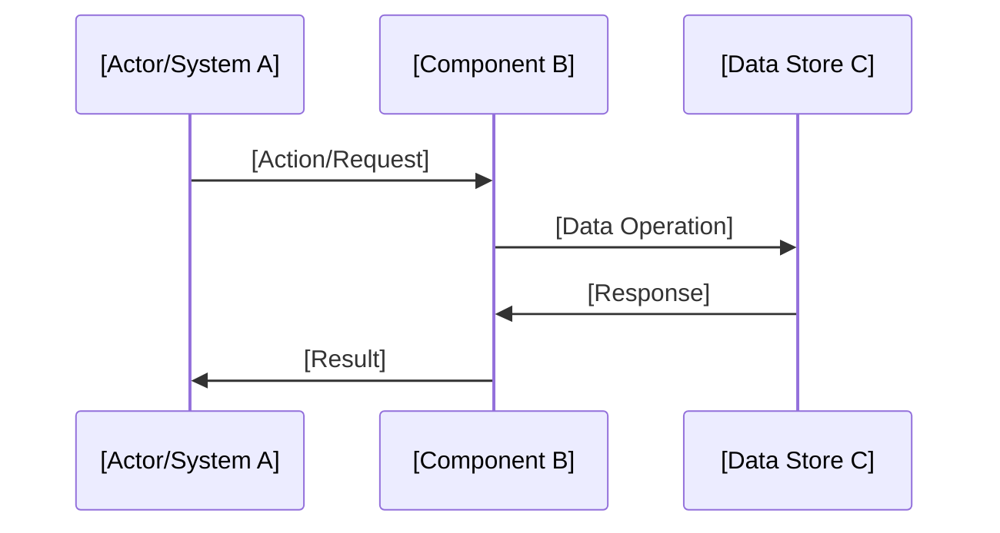

# [Feature/Application Name] - Design Brief

## Problem Statement
<!-- 
Clearly articulate the problem you're solving. This section should answer:
- What is the current situation/pain point?
- Who is affected by this problem?
- What are the consequences of not solving it?
- What constraints exist (technical, business, regulatory)?

Example: "The system currently lacks ability to X, causing Y impact on Z users..."
-->

[Describe the specific problem, current limitations, and why a solution is needed]

## Solution Overview
<!--
High-level description of your proposed solution. Keep it concise but complete:
- What is the core approach?
- How does it solve the problem?
- What are the main components?
- What's the expected outcome?

This should be understandable by both technical and non-technical stakeholders.
-->

[Provide a 2-3 paragraph overview of the solution approach and its key benefits]

## Key Design Decisions

### 1. [Decision Area 1 - e.g., Architecture Pattern]
<!--
For each major design decision, include:
- **Problem**: The specific challenge this decision addresses
- **Solution**: The chosen approach and why
- **Alternatives Considered**: Other options evaluated
- **Benefits**: Why this is the best choice
- **Trade-offs**: What we're giving up

Examples: Data storage strategy, API design, versioning approach, security model
-->

**Problem**: [Specific challenge]

**Solution**: [Chosen approach with rationale]

**Benefits**:
- [Benefit 1]
- [Benefit 2]
- [Benefit 3]

### 2. [Decision Area 2 - e.g., Data Model]

**Problem**: [Specific challenge]

**Solution**: [Chosen approach]

**Example**:
```[language]
// Include concrete examples of data structures, API calls, etc.
```

### 3. [Decision Area 3 - e.g., Integration Strategy]

[Continue pattern for all major design decisions]

## Technical Architecture

### System Components
<!--
Describe the main components and their responsibilities:
- What are the key modules/services?
- How do they interact?
- What are their boundaries and interfaces?
-->

```
[Component Diagram or Tree Structure]
├── Component A/     # [Responsibility]
│   ├── Module 1     # [Purpose]
│   └── Module 2     # [Purpose]
├── Component B/     # [Responsibility]
└── Component C/     # [Responsibility]
```

### Data Flow
<!--
Show how data moves through the system. Consider using:
- Sequence diagrams for complex interactions
- Simple flow descriptions for straightforward processes
- State diagrams for stateful components
-->



### Technology Stack
<!--
List the technologies, frameworks, and tools:
- Programming languages and frameworks
- Databases and storage solutions
- Third-party services and APIs
- Development and deployment tools
-->

- **Runtime**: [e.g., Python 3.11+, Node.js 20+]
- **Framework**: [e.g., FastAPI, Express]
- **Database**: [e.g., PostgreSQL, MongoDB]
- **External Services**: [e.g., AWS S3, SendGrid]
- **Key Libraries**: [e.g., Pydantic, React Query]

## Implementation Approach

### Development Phases
<!--
Break down the implementation into manageable phases/milestones:
- What can be delivered incrementally?
- What are the dependencies between phases?
- What constitutes an MVP vs full feature?
-->

#### Phase 1: [Foundation/MVP]
- [ ] [Deliverable 1]
- [ ] [Deliverable 2]
- [ ] [Core functionality]

#### Phase 2: [Enhancement]
- [ ] [Additional feature 1]
- [ ] [Performance optimization]
- [ ] [Extended functionality]

#### Phase 3: [Polish/Scale]
- [ ] [Advanced features]
- [ ] [Monitoring/observability]
- [ ] [Documentation completion]

### API/Interface Design
<!--
Define the main interfaces (if applicable):
- REST endpoints
- GraphQL schema
- CLI commands
- SDK methods
-->

```[language]
# Example API endpoint
POST /api/v1/[resource]
{
  "field1": "value",
  "field2": 123
}

# Example CLI command
app [command] [resource] --option value
```

## Stakeholder Benefits
<!--
Explicitly state benefits for each stakeholder group.
This helps justify the investment and sets expectations.
-->

### For End Users
- [User-facing benefit 1]
- [Improved experience aspect]
- [Time/effort saved]

### For Developers
- [Developer experience improvement]
- [Maintenance benefit]
- [Debugging/monitoring capability]

### For Operations/DevOps
- [Deployment simplification]
- [Monitoring/alerting improvement]
- [Scaling capability]

### For Business
- [Cost reduction/revenue opportunity]
- [Risk mitigation]
- [Competitive advantage]

## Risk Analysis & Mitigation

### Technical Risks
<!--
Identify technical risks and mitigation strategies:
- Performance bottlenecks
- Scaling challenges
- Integration complexities
- Security vulnerabilities
-->

| Risk | Impact | Probability | Mitigation Strategy |
|------|--------|-------------|-------------------|
| [Risk 1] | High/Medium/Low | High/Medium/Low | [Mitigation approach] |
| [Risk 2] | High/Medium/Low | High/Medium/Low | [Mitigation approach] |

### Data Integrity & Security
<!--
Address data and security concerns:
- Data validation strategies
- Authentication/authorization approach
- Compliance requirements
- Backup and recovery plans
-->

- **Validation**: [Approach to ensure data quality]
- **Security**: [Authentication, encryption, access control]
- **Compliance**: [GDPR, HIPAA, etc. if applicable]
- **Recovery**: [Backup strategy, rollback capability]

### Performance Considerations
<!--
Define performance requirements and strategies:
- Expected load and response times
- Caching strategies
- Database optimization
- Asynchronous processing needs
-->

- **Target Metrics**: [e.g., <200ms response time, 1000 RPS]
- **Optimization Strategy**: [Caching, indexing, CDN]
- **Monitoring**: [Metrics, alerts, dashboards]

## Dependencies & Prerequisites
<!--
List what needs to be in place before implementation:
- External services or APIs
- Infrastructure requirements
- Team skills or training needs
- Regulatory approvals
-->

### Technical Dependencies
- [Required service/API 1]
- [Infrastructure component]
- [Third-party library/service]

### Process Dependencies
- [Approval/sign-off needed]
- [Team or resource availability]
- [External vendor coordination]

## Success Criteria
<!--
Define measurable success metrics:
- Functional requirements that must be met
- Performance benchmarks
- Quality metrics
- Business KPIs
-->

1. **Functional**: [e.g., All specified features working without data loss]
2. **Performance**: [e.g., 95th percentile response time <200ms]
3. **Reliability**: [e.g., 99.9% uptime, <0.01% error rate]
4. **Scalability**: [e.g., Support 10x current load without degradation]
5. **Maintainability**: [e.g., 80% code coverage, documented APIs]
6. **Business**: [e.g., 20% reduction in support tickets]

## Open Questions & Decisions Needed
<!--
List unresolved questions that need answers before or during implementation:
- Technical decisions pending research
- Business rule clarifications needed
- Resource allocation questions
-->

1. [ ] [Question about requirement/approach]
2. [ ] [Decision needed on technology choice]
3. [ ] [Clarification on business rule]

## Appendices

### A. Glossary
<!--
Define domain-specific terms and acronyms
-->

- **[Term]**: [Definition]
- **[Acronym]**: [Expansion and explanation]

### B. References
<!--
Link to related documents, PRDs, designs, or external resources
-->

- [Related PRD or specification]
- [Technical documentation]
- [Similar implementations or case studies]

### C. Alternative Approaches Considered
<!--
Document significant alternatives that were evaluated but not chosen.
This provides context for future discussions and prevents revisiting rejected options.
-->

#### Alternative 1: [Name]
- **Description**: [Brief overview]
- **Pros**: [Advantages]
- **Cons**: [Disadvantages]
- **Reason for Rejection**: [Why not chosen]

---

**Document Status**: [Draft/Review/Approved]  
**Last Updated**: [Date]  
**Author(s)**: [Names]  
**Reviewers**: [Names]